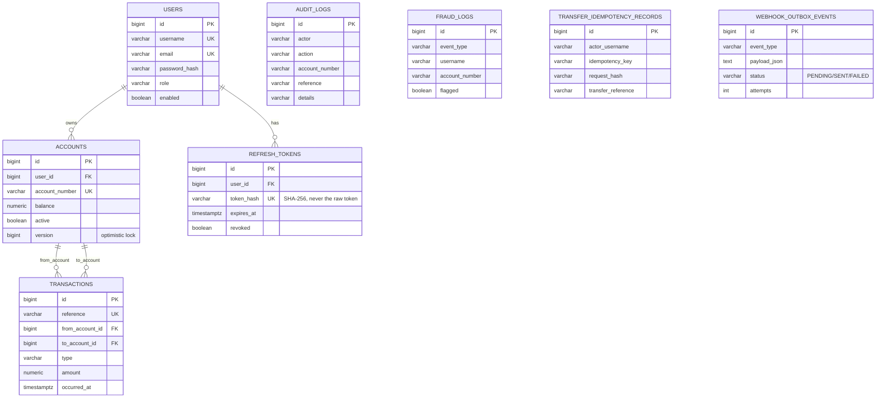

# NOVA Bank Core

API-first digital banking backend built with Spring Boot 3, PostgreSQL, JWT, and OpenAPI.

This project is designed as a portfolio-ready core banking MVP: secure auth, account lifecycle, transaction engine, operational controls, analytics, and auditability.

## Why this project stands out

- Secure API with role-based access (`ADMIN`, `CUSTOMER`, `AUDITOR`), JWT authentication, and rate-limited auth endpoints.
- Core money flows: deposit, withdraw, transfer, history, and balance management, safe under concurrent access via optimistic locking.
- Product-grade extras: transfer idempotency, CSV statements, account freeze controls, webhook alerts.
- Compliance visibility: audit and fraud endpoints for oversight roles.
- Versioned schema migrations (Flyway) instead of Hibernate auto-DDL — the schema has a reviewable history from day one.
- Fully documented API via Swagger/OpenAPI and covered by automated tests (unit + integration + concurrency).

## Tech Stack

- Java 17
- Spring Boot 3.3
- Spring Security + JWT
- Spring Data JPA (Hibernate) + Flyway migrations
- PostgreSQL
- Bucket4j (auth endpoint rate limiting)
- OpenAPI/Swagger (`springdoc`)
- Maven + JUnit 5 + Mockito + MockMvc + JaCoCo
- Docker + Docker Compose

## Architecture Snapshot

The system follows a clean layered architecture, with dependencies flowing strictly inward (controller → service → repository → model):

```mermaid
flowchart TB
    subgraph Client
        C[HTTP Client / Swagger UI]
    end

    subgraph "Servlet Filter Chain"
        CID[CorrelationIdFilter<br/>MDC correlation ID, runs first]
        RL[AuthRateLimitFilter<br/>429 on brute-force to /api/v1/auth/*]
        JWT[JwtAuthFilter<br/>validates Bearer access token]
    end

    subgraph "Controller Layer (/api/v1/**)"
        AuthC[AuthController]
        AcctC[AccountController]
        TxC[TransactionController]
        AdminC[AdminController]
    end

    subgraph "Service Layer"
        UserS[UserService]
        RefreshS[RefreshTokenService]
        AcctS[AccountService]
        TxCmdS[TransactionCommandService]
        TxQryS[TransactionQueryService]
        AdminS[AdminService]
        FraudS[FraudService]
        AuditS[AuditService]
        OutboxS[WebhookOutboxService]
    end

    subgraph "Background (own scheduled thread, never a request thread)"
        Dispatcher[WebhookDispatcher<br/>@Scheduled poll]
        WebhookS[WebhookService]
    end

    subgraph "Repository Layer (Spring Data JPA)"
        Repos[(UserRepository / AccountRepository / RefreshTokenRepository /<br/>TransactionRecordRepository / AuditLogRepository /<br/>FraudLogRepository / TransferIdempotencyRecordRepository /<br/>WebhookOutboxEventRepository)]
    end

    DB[(PostgreSQL<br/>schema owned by Flyway migrations)]
    Webhook[[External Webhook Endpoint]]

    C --> CID --> RL --> JWT --> AuthC & AcctC & TxC & AdminC
    AuthC --> UserS --> RefreshS
    AcctC --> AcctS
    TxC --> TxCmdS & TxQryS
    AdminC --> AdminS
    AdminC --> AcctS

    UserS --> AuditS
    UserS --> FraudS
    AcctS --> AuditS
    AcctS --> FraudS
    AcctS --> OutboxS
    TxCmdS --> AuditS
    TxCmdS --> FraudS
    TxCmdS --> OutboxS
    AdminS --> AuditS

    UserS & RefreshS & AcctS & TxCmdS & TxQryS & AdminS & FraudS & AuditS & OutboxS --> Repos
    Repos --> DB

    Dispatcher -->|poll PENDING/FAILED rows| Repos
    Dispatcher --> WebhookS -.HTTP POST.-> Webhook
```

- `controller`: REST API contracts — thin, delegate directly to services, map to DTOs (never
  expose JPA entities over the wire). Mechanically verified to never depend on `repository`
  directly (see `ArchitectureFitnessTests`).
- `service`: business rules, transaction orchestration, cross-cutting concerns (audit/fraud/
  webhook-outbox). `TransactionCommandService` (write) and `TransactionQueryService` (read) are
  split per single-responsibility rather than one class owning both; `AdminService` is the one
  path admin read endpoints take into the repository layer.
- `repository` (+ `repository.spec`): Spring Data JPA persistence access, including
  `Specification`-based dynamic filtering for transactions, admin audit logs, and admin fraud logs.
- `model` + `dto`: domain entities (JPA) and request/response schemas, kept strictly separate.
- `config` + `security` + `web`: auth (JWT filter, rate limiting), correlation ID, OpenAPI,
  bootstrap seeding, CORS/CSRF policy, environment profiles.
- `logging`: hand-rolled structured JSON log layout (no added dependency — see `JsonLogLayout`).
- `common`: small cross-cutting helpers (`SortSupport`, `PaginationDefaults`, `HashUtil`) shared
  across otherwise-unrelated services, replacing what used to be private, near-duplicated logic.

## Entity-Relationship Diagram



`AUDIT_LOGS`, `FRAUD_LOGS`, `TRANSFER_IDEMPOTENCY_RECORDS`, and `WEBHOOK_OUTBOX_EVENTS` are
intentionally not drawn with FK relationships to `ACCOUNTS`/`USERS` — they reference accounts by
`account_number`/`username` string rather than a foreign key, by design: an audit or fraud record
must remain readable and immutable evidence even if the referenced account is later deleted
(not currently possible via the API, but the schema does not assume it never will be).

## Architecture Decisions & Tradeoffs (ADR-style)

Short-form architecture decision records for the choices most likely to be questioned in review.

### ADR-1: PostgreSQL over a document store
**Decision:** PostgreSQL with strict relational modeling (foreign keys, unique constraints, `NUMERIC(19,2)` for money).
**Why:** Banking data is inherently relational (accounts belong to users, transactions reference two accounts, audit trails must never lose referential integrity) and requires strong consistency guarantees (ACID transactions) that a document store would require re-implementing at the application layer. `BigDecimal`/`NUMERIC` avoids floating-point rounding errors in money math.
**Tradeoff accepted:** Less schema flexibility than a document store; mitigated by Flyway migrations making schema evolution an explicit, reviewable process rather than a runtime concern.

### ADR-2: Flyway-managed schema instead of Hibernate `ddl-auto`
**Decision:** `ddl-auto: validate` in every profile; all schema changes ship as a new versioned SQL file under `src/main/resources/db/migration`.
**Why:** `ddl-auto: update` (the project's original approach) silently alters a live schema on every deploy with no review step, no rollback path, and no audit trail of what changed — an explicitly disqualifying pattern for a banking domain. Flyway makes every schema change a reviewable diff, and `validate` mode means the application refuses to start if the entity model and migrated schema ever disagree, catching drift at deploy time instead of at 2am in production.
**Tradeoff accepted:** Slightly more ceremony per schema change (write a migration file instead of just changing an `@Entity`); accepted because the safety guarantee is worth it for financial data.

### ADR-3: Optimistic locking (`@Version`) over pessimistic locking for account balances
**Decision:** `Account.balance` mutations are guarded by a JPA `@Version` column rather than `SELECT ... FOR UPDATE`/`PESSIMISTIC_WRITE`.
**Why:** Optimistic locking avoids holding database row locks for the duration of a transaction (better throughput under concurrent load) and fails fast with a specific, catchable exception (`ObjectOptimisticLockingFailureException`, mapped to HTTP 409) that a client can safely retry. Contention on a single account is expected to be low-frequency in normal usage (a user's own concurrent requests, not a shared hot row).
**Tradeoff accepted:** The caller (or a future retry-interceptor) is responsible for retrying on conflict — this pass does not add automatic server-side retry, only the safety mechanism and a test proving it prevents lost updates (`ConcurrentTransferTests`). A high-contention hot account (e.g. a shared merchant settlement account) would benefit from pessimistic locking instead; not needed at this project's scale.

### ADR-4: In-process rate limiting (Bucket4j) over a shared external store
**Decision:** `AuthRateLimitFilter` keeps per-IP token buckets in an in-process `ConcurrentHashMap`.
**Why:** Simplest correct solution for the project's actual deployment footprint — a single Render web service instance (see `render.yaml`). Adding Redis solely to coordinate rate-limit state across instances that don't exist yet would be premature infrastructure.
**Tradeoff accepted:** Does not share limit state across multiple instances. **Status: still open** — a Redis-backed `Bucket4j` implementation (via `bucket4j-redis` + a Lettuce/Jedis client) is the correct fix once this service is ever horizontally scaled, and was deliberately **not** implemented in this pass: doing so without a real Redis instance available to verify it against would mean shipping distributed-systems code with no evidence it actually works under concurrent access from multiple instances, which is a worse outcome than clearly documenting it as the next step. See Future Improvements.

### ADR-5: Database-level filtering via JPA `Specification` over in-memory filtering
**Decision:** Transaction listing/filtering/summary/CSV export, plus admin audit-log and fraud-log listing, build a `Specification<T>` translated into a SQL `WHERE` clause, with sorting and pagination pushed into `Sort`/`Pageable`, instead of loading full tables into a Java `List` and filtering with streams.
**Why:** The original in-memory approach loaded 100% of a user's transactions on every listing/summary/statement call regardless of filters — correct for a demo with a handful of rows, but it does not scale and defeats the purpose of the existing database indexes. The same principle was later extended to the admin audit/fraud log endpoints, which had no filtering at all.
**Tradeoff accepted:** `Specification`-based queries are less immediately readable than a derived query method name; accepted because the filters combine dynamically (any subset of date range, amount range, account scope, actor, action, username, event type) and a `Specification` composes cleanly where a combinatorial explosion of derived query methods would not.

### ADR-6: Transactional outbox for webhook delivery, instead of a synchronous in-request HTTP call
**Decision:** `TransactionCommandService`/`AccountService` write a `WebhookOutboxEvent` row (a fast, local database insert, part of the same transaction as the business change) instead of calling an external webhook endpoint directly. A separate `WebhookDispatcher`, running on its own `@Scheduled` thread, delivers pending rows asynchronously with retry and a dead-letter ceiling.
**Why:** The previous design called `WebhookService.notifyEvent()` synchronously from inside `TransactionService.performTransfer()`'s `@Transactional` scope — a slow or hung webhook target directly extended database lock hold time on `Account` rows during a live funds transfer. This is the single highest production-reliability risk a prior audit identified. The outbox pattern also gives an atomicity guarantee a bare `ApplicationEventPublisher` approach would not: the business change and the intent-to-notify either both commit or neither does, surviving a mid-transaction crash.
**Tradeoff accepted:** Webhook delivery is now eventually-consistent (typically delivered within one poll interval, default 2s) rather than "as soon as the transfer completes." A regression test (`WebhookOutboxDecouplingTest`) proves the request path is never blocked by a slow delivery attempt, using a deliberately slow mocked `WebhookService` to demonstrate what the old behavior would have done.

### ADR-7: Short-lived access tokens + a revocable refresh token, instead of an access-token blacklist
**Decision:** Access tokens (`security.jwt.secret`-signed JWTs) are now short-lived (15 min default, down from 24h) and remain stateless/unrevocable. A new, longer-lived (7 day default) opaque refresh token is persisted as a SHA-256 hash in `refresh_tokens`, individually revocable, and rotated on every use (old token revoked, new one issued); reuse of an already-rotated token revokes every active session for that user.
**Why:** A prior audit's Critical Issue #5 was "no refresh-token revocation — a leaked JWT remains valid for its full default lifetime with no server-side kill switch." A full access-token blacklist (checked on every request) would work too, but adds a database/cache read to every authenticated request forever; shortening the access token lifetime and adding a revocable refresh token achieves the same practical kill-switch (revoke the refresh token; the access token expires naturally within 15 minutes either way) without that per-request cost.
**Tradeoff accepted:** A stolen access token remains valid for up to 15 minutes even after the corresponding refresh token is revoked — an accepted, bounded exposure window, not an eliminated one. Reuse detection (rotating a refresh token that was already used) is a strong theft signal but not proof; the response (revoke all sessions) deliberately errs toward safety over convenience.

## Main API Capabilities

All endpoints are versioned under `/api/v1` (see ADR-6). A future breaking change ships as
`/api/v2` alongside the existing `/api/v1` routes rather than breaking existing clients in place.

### Authentication

- `POST /api/v1/auth/register` — returns a short-lived access token + a refresh token
- `POST /api/v1/auth/login` — same response shape
- `POST /api/v1/auth/refresh` — exchanges a refresh token for a new access + refresh token pair (rotation)
- `POST /api/v1/auth/logout` — revokes a refresh token

### Accounts

- `GET /api/v1/accounts`
- `POST /api/v1/accounts`
- `POST /api/v1/accounts/deposit`
- `POST /api/v1/accounts/withdraw`

### Transactions

- `GET /api/v1/transactions/my`
- `GET /api/v1/transactions/summary`
- `GET /api/v1/transactions/statement` (CSV export)
- `POST /api/v1/transactions/transfer`

`POST /api/v1/transactions/transfer` supports optional header:

- `Idempotency-Key: <unique-key>`

This prevents duplicate transfers during safe retries.

### Admin and Oversight

- `GET /api/v1/admin/accounts` (filtering by `active`/`username`, sorting via `sort=field,dir`)
- `PATCH /api/v1/admin/accounts/{accountNumber}/status` (freeze/reactivate)
- `GET /api/v1/admin/audit` (filtering by `actor`/`action`, sorting)
- `GET /api/v1/admin/fraud` (filtering by `username`/`eventType`, sorting)

Every call to the audit/fraud/account listing endpoints is itself recorded as an audit event
(`ADMIN_AUDIT_LOG_READ` / `ADMIN_FRAUD_LOG_READ` / `ADMIN_ACCOUNT_LIST_READ`) naming the reading
admin — compliance visibility now covers who *read* sensitive data, not just who wrote it.

### Observability

- `GET /actuator/health`, `/actuator/info` — as before.
- `GET /actuator/metrics`, `/actuator/prometheus` — a real Micrometer + Prometheus registry
  (`micrometer-registry-prometheus`), closing the "no monitoring at all" gap. Permitted alongside
  health/info without authentication, matching a typical unauthenticated Prometheus scrape
  config — a real production rollout would restrict this to an internal network.
- Structured JSON logging (hand-rolled Logback layout, no new dependency — see
  `JsonLogLayout`) under the `staging`/`prod` profiles; human-readable console output under
  `dev`/`local`/default. Every log line carries the request-scoped correlation ID
  (`CorrelationIdFilter`, echoed back as the `X-Correlation-Id` response header) and, when
  present, the active trace/span ID.
- Distributed tracing **instrumentation only** (Micrometer Tracing + Brave bridge + a Zipkin
  reporter, configured via `management.tracing.*`/`management.zipkin.*`) — **not verified
  against a live collector** in this environment. Point `MANAGEMENT_ZIPKIN_TRACING_ENDPOINT` at
  a real Zipkin (or OTel-collector-with-Zipkin-endpoint) instance to actually receive spans.

## Swagger / API Docs

- Swagger UI: `http://localhost:8080/swagger-ui.html`
- OpenAPI JSON: `http://localhost:8080/v3/api-docs`

To call protected endpoints in Swagger:

1. Login via `POST /api/v1/auth/login`.
2. Copy the JWT token.
3. Click **Authorize** and use `Bearer <token>`.

## Database Migrations

Schema is managed exclusively by [Flyway](https://flywaydb.org/) migrations under `src/main/resources/db/migration` — `spring.jpa.hibernate.ddl-auto` is set to `validate` in every profile (including Docker/Render), meaning the application will refuse to start if the entity model and the migrated schema ever disagree. `V1__baseline_schema.sql` was generated by diffing a real Hibernate-created schema (`pg_dump --schema-only` against a disposable PostgreSQL 16 instance) so adopting Flyway did not require any destructive schema recreation. `V2__webhook_outbox.sql` and `V3__refresh_tokens.sql` added the outbox and refresh-token tables in this pass.

Any future schema change must ship as a new `V{n}__description.sql` file — never by relying on Hibernate auto-DDL.

**This is verified against a real PostgreSQL instance, not just asserted:** every other integration test in this suite runs against H2 (Flyway is explicitly disabled for the test classpath — the migration SQL is PostgreSQL-specific and was never meant to run against H2). `FlywayMigrationPostgresIT` is the exception: it boots the full Spring context against a real, disposable PostgreSQL 16 container (Testcontainers) with Flyway actually enabled and `ddl-auto=validate` actually enforced. This test caught a real bug during development — `WebhookOutboxEvent.payloadJson` was originally annotated `@Lob`, which Hibernate 6 maps to a PostgreSQL `oid` large-object column, not the `TEXT` column `V2` actually created; schema validation failed the moment this test ran against real Postgres, while every H2-backed test stayed green throughout. This is exactly the class of bug an H2-only test suite structurally cannot catch.

## Quick Start (Docker)

Prerequisites: Docker and Docker Compose.

`docker-compose.yml` no longer contains any hardcoded credentials (a prior audit flagged a
committed JWT secret and database password in this file). Create a local `.env` first:

```bash
cp .env.example .env
# edit .env: set POSTGRES_PASSWORD and SECURITY_JWT_SECRET to your own local-only values
# (openssl rand -base64 32 for the JWT secret)
docker compose up --build
```

Docker Compose automatically loads `.env` from the project root for variable substitution;
`docker-compose.yml` will fail fast with a clear error if `POSTGRES_PASSWORD` or
`SECURITY_JWT_SECRET` is missing, rather than silently falling back to a hardcoded value.

On startup, Flyway automatically applies all pending migrations against the `nova-bank-db` Postgres container before the application accepts traffic.

Service mapping with current compose setup:

- API container listens on `8080`
- Host port exposed as `8081`

So access docs at:

- `http://localhost:8081/swagger-ui.html`

Stop services:

```bash
docker compose down
```

## Run Locally (without Docker)

Prerequisites:

- Java 17+
- Maven
- PostgreSQL running locally

Run:

```bash
mvn spring-boot:run
```

Default local app URL:

- `http://localhost:8080`

## Default Development Admin

On startup, an ADMIN user is bootstrapped if missing (`BootstrapConfig`) — but **the password is
never a hardcoded default**. This was a real, critical vulnerability found in an earlier audit:
the seeded password fell back to a well-known, publicly-documented value (`admin12345`)
unconditionally, including in a live deployment, since nothing ever overrode it. The fix:

- If `APP_BOOTSTRAP_ADMIN_PASSWORD` (`app.bootstrap.admin.password`) is set explicitly, it is
  always used, in every environment.
- If it is **not** set and the active Spring profile (`SPRING_PROFILES_ACTIVE`) is `dev` or
  `local`, a fresh cryptographically random password is generated on every startup and printed
  to the application log at `WARN` level — safe only because those profiles are never used for a
  shared/production deployment (mirrors the convention Spring Boot itself uses for its own
  default user).
- If it is not set under any other profile — including no profile at all — **the application
  refuses to start**, throwing `IllegalStateException` during startup rather than silently
  seeding a guessable credential.

See `render.yaml` (provisions `APP_BOOTSTRAP_ADMIN_PASSWORD` via Render's `generateValue: true`,
same mechanism as `SECURITY_JWT_SECRET`) and `docker-compose.yml` (runs with
`SPRING_PROFILES_ACTIVE=dev` and intentionally leaves the password unset to demonstrate the safe
random-generation path — check `docker compose logs nova-bank-app` for the generated value).

## Testing and CI

Run tests:

```bash
mvn test
```

Run CI-equivalent build:

```bash
mvn -B -DskipITs verify
```

Note: tests require `SECURITY_JWT_SECRET` to be set in the environment (any Base64 string decoding to 32+ bytes — see `.env.example` for a generation command), since `JwtService` validates it at startup.

Generate a test coverage report (JaCoCo):

```bash
mvn test jacoco:report
# open target/site/jacoco/index.html
```

Run the full verification pipeline, including the real-PostgreSQL Testcontainers integration test (requires Docker):

```bash
mvn verify
# equivalent to: mvn test (surefire, *Test.java/*Tests.java) + mvn failsafe:integration-test
# (FlywayMigrationPostgresIT, matched by the *IT.java naming convention)
```

Current suite covers:

- Authentication and registration, including a regression test proving the client cannot self-assign an elevated role.
- Refresh-token rotation and revocation: `AuthRefreshFlowTests`/`RefreshTokenServiceTest` cover issuing, rotating, logout, and — specifically — that reusing an already-rotated refresh token is rejected and revokes every active session for that user, not just the reused one.
- Account and transfer flows, edge cases (negative amounts, insufficient funds), and idempotency behavior (duplicate-key reuse, conflicting-payload rejection).
- Concurrency correctness: `ConcurrentTransferTests` fires many simultaneous deposits at the same account and asserts the final balance has zero lost updates, proving the `@Version` optimistic lock actually prevents the race it's designed to prevent.
- Rate limiting: `AuthRateLimitTests` proves `/api/v1/auth/login`/`register` return 429 once a client exceeds the configured limit, and that limits are isolated per client IP.
- Admin controls (freeze/reactivate, filtered/sorted listing of accounts/audit/fraud logs, with admin-read audit logging), CSV statement export.
- Webhook reliability: `WebhookOutboxDecouplingTest` configures a deliberately slow (3s) mocked webhook delivery and asserts a large transfer's HTTP response still returns in a small fraction of that time — proving the request path can never be blocked by a slow webhook target. `WebhookTriggerIntegrationTests`/`WebhookOutboxServiceTest`/`WebhookDispatcherTest` cover outbox enqueueing and the dispatcher's retry/dead-letter behavior.
- Query efficiency: `AdminAccountNPlusOneTests` uses Hibernate's `Statistics` API to assert that listing accounts from multiple distinct owners executes a small, constant number of SQL statements rather than one query per row.
- Architectural fitness: `ArchitectureFitnessTests` (ArchUnit) mechanically enforces that controllers never depend on repositories directly, services never depend on controllers, and the model layer has no outward dependency — the exact class of violation `AdminController` had before `AdminService` was introduced.
- Real-database migration verification: `FlywayMigrationPostgresIT` (Testcontainers) boots the full application against a disposable PostgreSQL 16 container with Flyway and `ddl-auto=validate` actually enabled — see "Database Migrations" above for a real schema bug this test caught that H2 could not.
- Unit tests (Mockito-mocked collaborators, no Spring context) for `FraudService`, `AuditService`, `JwtService`, `WebhookService`, `WebhookOutboxService`, `WebhookDispatcher`, `RefreshTokenService`, and `BootstrapConfig`'s admin-credential fail-fast logic — isolating business logic from the database/HTTP layer.

## Deployment Notes

- Recommended for full backend hosting: Render, Railway, Fly.io, AWS, or similar Java-friendly platforms.
- Vercel is suitable for hosting a static Swagger docs frontend, not the full Spring Boot runtime.

### Render Quick Deploy

This repository includes `render.yaml` for a Docker web service and managed Postgres database.

1. Push to GitHub.
2. Create a Render **Blueprint** from this repository.
3. Render auto-provisions:
   - `nova-bank-api` (web service)
   - `nova-bank-db` (Postgres)
4. Render generates `SECURITY_JWT_SECRET` and `APP_BOOTSTRAP_ADMIN_PASSWORD` automatically
   (`generateValue: true`) — the application will refuse to start without the latter, since
   `render.yaml` sets `SPRING_PROFILES_ACTIVE=prod`, which is not one of BootstrapConfig's
   dev/local exceptions.

Runtime environment variables are documented in `.env.example`.

### CD Pipeline (unverified)

`render.yaml` sets `autoDeploy: false` — Render no longer deploys automatically on push.
`.github/workflows/cd.yml` is the only path to production: it runs after the CI workflow
completes successfully on `main`/`master`, triggers a Render deploy of the exact commit CI just
validated, polls the deploy until it is live, health-checks the deployed service
(`/actuator/health`), and **automatically rolls back to the last known-live commit** if the
health check fails.

**This workflow is authored and reasoned through against Render's public API and GitHub Actions
semantics, but has not been executed against a live Render account/service in this development
environment** — there was no Render API key or provisioned service available to test it against.
Treat it as a reviewed, ready-to-configure starting point, not a proven-working pipeline, until
someone with real Render credentials runs it once. Required repository secrets (see the
workflow file's header comment for details): `RENDER_API_KEY`, `RENDER_SERVICE_ID`,
`PROD_HEALTH_URL`.

Similarly, `OpenApiConfig` lists `https://nova-bank-api.onrender.com` as the production server
and the workflow above targets `/actuator/health` on that same host, but **there is no
in-repository evidence that URL is currently live** — no CI step in this environment has
actually pinged it. A real deployment should add a lightweight scheduled health-check workflow
(or an uptime-monitoring badge) once the service is actually provisioned, to make "is the demo
live" independently verifiable rather than asserted.

## Portfolio Positioning

This repo demonstrates end-to-end backend product thinking:

- Domain modeling for financial operations
- Security-first API design
- Reliability features (idempotency + audit trail)
- Operational/admin tooling
- Automated verification and containerized delivery

If you are evaluating this project as a portfolio artifact, start with Swagger and run the transaction and admin flows to see the product behavior quickly.

**On screenshots/demo media:** this README intentionally does not include Swagger UI
screenshots or a demo GIF/video. Producing authentic ones requires actually running the
application and capturing a real interactive session, which was out of scope for this
remediation pass — in keeping with this project's stated preference for transparency over
presentation (see "Spec vs. Implementation" below), a placeholder or fabricated screenshot is
not included. Run `docker compose up --build` and open `http://localhost:8081/swagger-ui.html`
(or `mvn spring-boot:run` + `http://localhost:8080/swagger-ui.html`) to see it live in under a
minute.

## Challenges

- **Privilege escalation via public registration.** An earlier version of `RegisterRequest` exposed a client-settable `role` field with no server-side restriction, meaning any unauthenticated caller could self-provision an ADMIN account. Found during an internal security-focused code review. Fixed by removing the field from the DTO entirely (not just ignoring it) — registration always creates a `CUSTOMER` server-side, and elevated roles can only ever be granted through a separate authenticated administrative action. A regression test (`AuthControllerTests.registrationIgnoresClientSuppliedAdminRoleField`) sends a raw payload containing `"role":"ADMIN"` and asserts the persisted user is still `CUSTOMER`.
- **Proving a concurrency fix actually works, not just adding the annotation.** Adding `@Version` to `Account` is one line; proving it prevents the lost-update race it's meant to prevent required an actual concurrency test (`ConcurrentTransferTests`) firing many simultaneous deposits at one account from a thread pool, with a retry-on-conflict loop mirroring what a real API client should do on a 409, and asserting the final balance exactly matches the sum of successful deposits.
- **Retrofitting Flyway onto an existing Hibernate-managed schema without a destructive reset.** The schema had been evolving via `ddl-auto: update` with no migration history. Generating an accurate baseline required actually running the application against a disposable PostgreSQL 16 container with `ddl-auto: create` and diffing the resulting `pg_dump` output, rather than hand-guessing column types/constraints from the entity classes (which would have risked a baseline that silently drifted from the real schema on day one).
- **Test isolation with shared security-infrastructure state.** Adding a stateful `AuthRateLimitFilter` (in-memory buckets keyed by client IP) broke ~10 unrelated integration tests that happened to share MockMvc's fixed `127.0.0.1` remote address and Spring's cached `TestContext` across the whole suite run. Solved by disabling the filter by default for the test classpath (`src/test/resources/application.yml`) and re-enabling it explicitly, in isolation, only in the dedicated `AuthRateLimitTests` class.
- **An H2-only test suite hid a real PostgreSQL schema bug for the entire development pass.** `WebhookOutboxEvent.payloadJson` was originally mapped `@Lob`, which is a perfectly valid, compiling, H2-passing mapping — every H2-backed integration test stayed green. The moment `FlywayMigrationPostgresIT` ran the same code against a real PostgreSQL 16 container, schema validation failed immediately: Hibernate 6 maps a `@Lob String` to a PostgreSQL `oid` large-object column, not the plain `TEXT` column the Flyway migration actually created. This is precisely the class of bug an all-H2 test suite is structurally unable to catch, and is the concrete justification for adding a real containerized-database test rather than treating "the migration file exists" as sufficient evidence it works.
- **Making a synchronous-webhook fix provable, not just plausible.** Moving the webhook call out of `TransactionCommandService`'s transactional scope is a straightforward refactor; proving it actually removes the reliability risk required a test that would have failed under the old design — `WebhookOutboxDecouplingTest` configures a deliberately slow (3s) webhook delivery and asserts the transfer's HTTP response still returns in well under half that time, the same "prove it, don't just claim it" discipline already applied to the concurrency and N+1 fixes.

## Tradeoffs

See the [Architecture Decisions & Tradeoffs](#architecture-decisions--tradeoffs-adr-style) section above for the seven most significant ADRs (PostgreSQL vs. document store, Flyway vs. `ddl-auto`, optimistic vs. pessimistic locking, in-process vs. shared rate limiting, `Specification`-based DB filtering vs. in-memory filtering, transactional outbox vs. synchronous webhook calls, short-lived-access-plus-refresh vs. an access-token blacklist).

Audit logging and fraud checking remain direct synchronous method calls from
`TransactionCommandService`/`AccountService` (only webhook notification was moved to the
transactional outbox — see ADR-6) — both are fast, local database writes with no external I/O,
so the reliability risk that justified decoupling the webhook call does not apply to them. Fully
decoupling every cross-cutting concern via domain events would be the natural next step if more
expensive side effects are ever added to the transfer/account-status code paths.

## Lessons Learned

- A hiring-committee-style adversarial review catches classes of bugs that "it works when I test it" does not — the role-escalation vulnerability was never exercised by the existing test suite because every test that registered a user explicitly set `CUSTOMER`, never attempting the attack path a real adversary would try first.
- Concurrency bugs are invisible until you write a test that actually creates concurrency. `AccountService.deposit()`/`withdraw()` had passed every existing test for months without `@Version`, because no test ever ran two requests against the same account at the same time.
- Global mutable state (rate-limit buckets, or any in-memory cache) introduced for a legitimate production reason has to be explicitly designed for test-suite isolation from day one, or it silently couples unrelated tests together in ways that are confusing to debug after the fact.
- An in-memory database is a productivity tool, not a substitute for testing against the real database engine a system will actually run on — H2 gave fast, isolated tests for months while quietly never exercising the real PostgreSQL-specific migration SQL at all (Flyway is disabled for the entire H2 test classpath). A single Testcontainers-backed test closed that gap and immediately found a real, previously-invisible schema mismatch.
- A fix for a reliability risk is not "done" until there is a test that would have failed under the old design — deleting a synchronous call and replacing it with an outbox write is easy to get subtly wrong (e.g. accidentally still blocking on something else); a test that simulates the exact slow-dependency scenario the fix targets is what actually closes the loop.

## Future Improvements

**Completed in this pass** (originally listed here as future work): splitting the transaction service into `TransactionCommandService`/`TransactionQueryService`; decoupling webhook delivery via a transactional outbox with async dispatch (ADR-6); Micrometer + Prometheus metrics; structured JSON logging with correlation IDs; refresh-token rotation with revocation (ADR-7); environment-specific Spring profiles (`dev`/`staging`/`prod`); a real Testcontainers-backed PostgreSQL integration test for the Flyway migration chain; ArchUnit architectural fitness tests; a CD pipeline with a health-check gate and automatic rollback (unverified against a live account — see "CD Pipeline (unverified)" above).

Genuinely still open, roughly in priority order:

1. Move rate limiting to a shared store (Redis-backed Bucket4j) if this service is ever horizontally scaled beyond the single Render instance it targets today — deliberately not implemented in this pass rather than shipped unverified against a real Redis instance (see ADR-4).
2. Add CSV/formula-injection sanitization to `TransactionQueryService.buildStatementCsv()` (prefix values starting with `=`, `+`, `-`, `@` with a safe character) before a `note` field is ever rendered by a spreadsheet application.
3. Wire the distributed tracing instrumentation (Micrometer Tracing + Brave + Zipkin reporter) to a real collector and add trace spans around the database layer (currently only web-request spans are automatic; the JDBC layer would need `datasource-proxy`/P6Spy or Micrometer's JDBC instrumentation, not added in this pass — see "Observability" above).
4. Add real dashboards/alerts on top of the now-real `/actuator/prometheus` metrics (Grafana or equivalent) — the metrics are exposed, but nothing currently visualizes or alerts on them.
5. Verify and badge the live Render deployment once a real account/service exists (see "CD Pipeline (unverified)" above) and add screenshots/a short demo GIF of Swagger UI in action to this README.
6. Audit-log tamper-evidence (hash chaining or a write-once DB constraint) — audit and fraud logs are append-only in normal application usage but not enforced at the database level against a determined admin-role actor.

## Spec vs. Implementation

`project.md` (the original development brief) is kept in the repository as historical context, but predates several implementation decisions. For transparency, here is how its claims reconcile with what is actually implemented:

| `project.md` claim | Actual status |
|---|---|
| "Multi-layer authentication: Password + OTP/Email confirmation" | Not implemented. Authentication is single-factor (password + JWT). OTP/email confirmation is out of scope for this pass. |
| "Logging & Monitoring: Logback + Actuator + Prometheus (optional)" | Implemented: Actuator `health`/`info`/`metrics`/`prometheus`, `micrometer-registry-prometheus`, and structured JSON logging (staging/prod profiles) with correlation-ID propagation. Distributed tracing is instrumented (Micrometer Tracing + Brave + Zipkin reporter) but not verified against a live collector — see "Observability" above. |
| "SQL migrations (schema.sql, data.sql)" | Implemented via Flyway (`src/main/resources/db/migration`), not the originally-specified `schema.sql`/`data.sql` convention — Flyway is the more standard, versioned approach for a Spring Boot project and supersedes this line item. |
| "Protect against SQL injection, CSRF, and XSS" | SQL injection: mitigated (100% Spring Data JPA parameterized queries, no raw SQL). CSRF: intentionally disabled — this is a stateless, header-based JWT API with no cookie-based session, so CSRF does not apply in the traditional sense. XSS: not directly applicable (pure JSON REST API, no server-rendered HTML views). |
| "Test coverage target: 80%+" | JaCoCo is now configured (`mvn test jacoco:report`); see the generated report for current coverage rather than treating this as an unverified claim. |

If you are reading this as a hiring reviewer: the intent of this table is to be honest about scope boundaries rather than let an outdated planning document imply capabilities that were not built.
